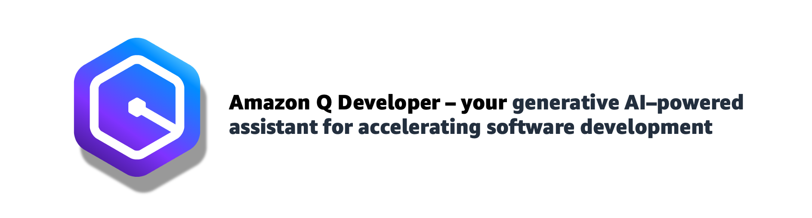

## Next Generation Developer Tools

*A hands on guide to working with Amazon Q Developer. Made by DevRel with 💖.*

In this hands on lab, we are going to run through how to use the next generation of developer tooling (Amazon Q Developer) to help make our jobs as developers more enjoyable and productive. We will create a new application from scratch, and then build upon this and perform many of the tasks you would typically do as a developer. **You do not have to have an AWS account or be an AWS user to go through this workshop**.

One thing to bear in mind before we start. Unlike other workshops, because of the non deterministic nature of these tools, there is no guarantee that the output will be the same as what your peers will see. What that means is that if you are working in groups, you can all expect different outputs. We have provided a [sample repo](https://github.com/094459/q-developer-workshop-demo-code) that you can use as a baseline, but we encourage you to explore and work with your own experiments - this is the most effective way of learning how these tools work.
 
The workshop is split into a number of different labs which you can run either within a controlled workshop, or at your own pace. Feel free to contact me if you run into any issues.

---

**What you will need**

You will need VScode IDE (or as an alternative, IntelliJ) with the following VSCode plugins installed

* Amazon Q Developer plugin - https://marketplace.visualstudio.com/items?itemName=AmazonWebServices.amazon-q-vscode 
* (optional) Database Client JDBC - https://marketplace.visualstudio.com/items?itemName=cweijan.dbclient-jdbc
* git

**How do follow along**

Given the non deterministic nature of generative AI tools, the output you will get from running these prompts will be different to the output I got when creating this. You might be asking yourself, how will I know what is right or wrong, and how will I cope if things go horribly wrong? This is kind of intentional. Working with generative AI tools like Amazon Q Developer open you up to a new flow, a new way of working. If your expectation was that these tools will generate working code every time, then it is time to reset that expectation. The output that these tools provide will be your starting point, and get you 80% of the way there. You can then use Amazon Q Developer to help iterate and complete the remaining. If that does not work, at each different section of this lab, the git repo has a number of checkpoints. These have been implemented as branches, so you can start off without worrying if the previous lab failed.

Everyone running through this lab will have a different experience, but I hope the takeaway from this is a better understanding of the flow you will start to develop in using these tools to write software.

If you are working through this in a group setting, then the person running the lab will lead from the front and you can take your guidance from them.

## Installation and Setup

You do not need an AWS account to use the Amazon Q Developer plugin. You can use the free tier by [creating a Builder ID](https://aws-oss.beachgeek.co.uk/44y), and then using that Builder ID to login.

[Follow this link](workshop/setup.md) to get started with installing the Amazon Q Developer plugin.

## Building our new application

Now that we have everything setup and we have explored how Amazon Q Developer works, lets start building something.

In this lab we are going to build an application in Python. We have chosen Python as it makes it easy to follow along and understand how these next generation developer tools work. 

We are going to build a **customer feedback survey** application. The application will initially have some basic functionality, an MLP - Minimum Lovable Product. We will be using Amazon Q Developer to help us add code and improve the basic functionality.

* [Building our application - Part One](workshop/building-our-app-part-1.md) - starting off by defining our data model
* [Building our application - Part Two](workshop/building-our-app-part-2.md) - we will build a functioning application 
* [Building our application - Part Three](workshop/building-our-app-part-3.md) - we will refine and improve our application

### Feedback and additional resources

Now that you have completed this Amazon Q Developer workshop, I hope you are beginning to see how you can use this as part of your day to day work. I have provided some [additional resources](workshop/resources.md) that you can review that share useful links to content, community spaces, and essential updates to keep up with the fast moving pace. I have also put togehter a [reference guide](workshop/reference.md) where you will find a handy list of the important things when using Amazon Q Developer.

**Feedback please**

If you found this useful, please [provide feedback](https://pulse.aws/survey/1DM5TAZU) where I share some additional resources from some of my talks on Amazon Q Developer.