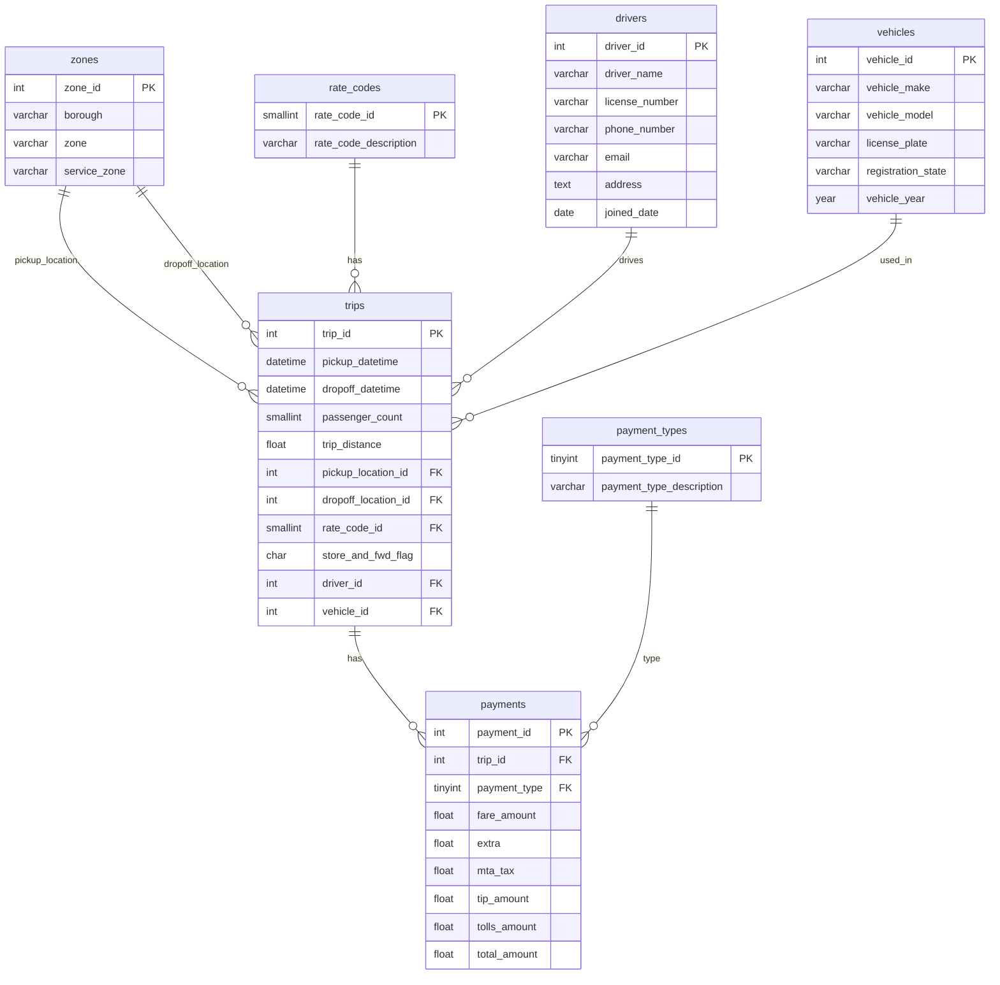

### Building our application - Working with Data

**Overview**

In this lab we are going to take a slight detour and spend some time looking at how next generation developer tools like Amazon Q Developer can help us be more effecient when working with data. We have already seen how we can use Amazon Q to help us scaffold data models, but we can do more than that. We are going to dive a little deeper into that topic before looking at how we can write queries, understand database applications written in SQL, show how Database System Administrators (DBA's) can benefit, explore the wonderful world of synthentic data generation, and more.


> **Additional Reading Materials**
>
> *Here are some additional reading materials that are useful to dive deeper into how large language models and generative AI developer tools like Amazon Q work with SQL. After you have completed this lab you might find them helpful if you want to have a deeper understanding of how they work
>
> * [Improving how Amazon Q writes SQL by using context](https://community.aws/content/2oft0CjVFvJFbRoPlLdUbi7o6hM/writing-sql-with-amazon-q-developer-workspace-context)
> * [Good practices for using text to SQL] (https://community.aws/content/2oRFLQEJj1RWA8OumcGD9lNv7JY/best-practices-for-text-to-sql-use-cases-with-llms)
>

The 'complete' code for this lab can be found [here](https://github.com/094459/q-developer-workshop-demo-code/tree/lab-d01) and you can refer to it if you get stuck.

---

**Task D1**

1/ We are going to first set our codebase to the following baseline so everyone is on the same page.

```
git checkout lab-01
```

2/ Next we are going to use a VSCode plugin called [Database Client JDBC](https://marketplace.visualstudio.com/items?itemName=cweijan.dbclient-jdbc) which makes it super easy to access databases via graphical UI.

3/ Close all open files and tabs from within VSCode. From the Amazon Q Chat interface, enter the following:

> Create SQL code for a customer feedback application

Review the output. Keep the chat interface conversation open.

4/ Open up the **app.py** Python code so that it is displayed within the VSCode editor, and then repeat the prompt:

> Create SQL code for a customer feedback application

Review: How does the chat interface language change? What does the SQL look like? This is an example of how Amazon Q uses the file you have open to provide more context. This is very important as you use these tools to understand how to influence the output.

5/ Close the app.py so that you have no open files. Close the chat tab to close the conversation, and then open up a new chat interface tab. Type in the following prompt:

> Create a data model for a customer survey application in Python

Review the output. This time open the **customer-feedback.sql** in the data folder so that it is the only file open in VSCode. Enter the prompt again:

> Create a data model for a customer survey application in Python

Review: How does the output differ? Again, you can see how having a specific file open can help you get better output.

---

**Task D2**

In this task we are going to see how we can generate diagrams from our SQL, as well as generate SQL from our diagrams. We will need to install a VSCode plugin if you do not already have this installed. From the VSCode marketplace, find the following plugin


You can use [this link](https://marketplace.visualstudio.com/items?itemName=shd101wyy.markdown-preview-enhanced)

This will provde you with a new option when you right click on any markdown document, as follows:


1/ Open up the **customer-feedbck.sql** file and from a new chat interface, add the following prompt:

> create a mermaid diagram of this sql code that I can display in a markdown doc

Review the output. In the same directory (data) create a new file called **"customer-feedback.md"** and add then copy the contents into the file. If you try and display this as it is, it will not work ( try it ). We need to add the markdown tag so that it knows to use the Mermaid diagram extension. If you are new to this, we can easily do this with the help of Amazon Q.

2/ Select all the code in the newly create file, and then use the Amazozn Q menu integration (right click, Amazon Q > Send to Prompt). From the prompt, enter the following:

> Add the markdown to display this

After a while you should see some updated code. Overwrite the contents with the output from the chat inteface (after reviewing), and then try again with the enhanced Markdown preview. You should get something like this.


Close all the tabs in VScode.

3/ We can also generate SQL from existing mermaid diagrams we might have. This can be useful if you have some applications documented but you do not have the SQL code to recreate it. We are going to try this using a mermaid diagram that is not related to this application we are building. The New York Taxi data set is a very well known data set used when demoing data and analytics solutions. We have a mermaid diagram that explains the schema for this data.




Create a new folder called "lab-data" and then within this folder create a new file called "ny-taxi.md" and copy the contents of this file into file. Once saved, you can explore using the enhanced Markdown preview.

4. We will now generate SQL code from this by using the following prompt:

> generate SQL code from this mermaid diagram

Review the output. Does it look ok to you?

Before we proceed, close all open tabs in VSCode.

---


**Task D3**

We can use Amazon Q Developer to help us translate SQL from one dialect to another. Developers may occasionally need to work between different SQL dialects (for example, SQL Server and PostgreSQL) and so having a tool that can automte this tedious task is going to be really helpful. 

1/ Close all existing tabs/files in VSCode. Open up the **"customer-feedback.sql"** in the data folder.

2/ From a new chat interface tab, enter the following prompt, changing "MS SQL Server" for a dialect you are most familiar with.

> convert SQL so that it is optimised for MS SQL Server

Review the output, and then try again with different SQL dialects such as MySQL, PostgreSQL, and Oracle.

**(optional)**

3/ We can start a local a local Postgres database using the following Docker compose file. Create a new folder called Docker and within this folder a file called "local-postgres.yml". Add the following to this file and then save it.

```
version: '3'
volumes:
  psql:
services:
  psql:
    image: postgres:15.6
    environment:
      POSTGRES_USER: postgres
      POSTGRES_PASSWORD: change-me
    volumes:
      - psql:/var/lib/postgresql/data 
    ports:
      - 5432:5432
```

You can now start and stop a local PostgreSQL server using the following commands:

To start/

```
cd Docker
docker compose -p local-postgres -f local-postgres.yml up
```

To stop/

From within the running container, press CTRL and C to break, and then enter the following command

```
docker compose -p local-postgres -f local-postgres.yml down
```

You can access the local Postgres database using the user "postgres" with the password "change-me"

4/ Using the Data Client JDBC tool, add a new local connection to the local PostgreSQL database, and create a new database. 

Run the following prompt from the chat interface.

> convert SQL so that it is optimised for Oracle

Take the SQL and try running these queries in the new local PostgreSQL database you created. These should fail. No try the following prompt from the chat inteface

> convert SQL so that it is optimised for PostgreSQL 15

And repeat the process. This time you should see that the SQL generation works and you now have the application running locally.

5/ Shut down the local PostgreSQL database by doing CTRL + C, and then running the following command

```
docker compose -p local-postgres -f local-postgres.yml down
```

---

**Task D4**

If you spend a lot of time working with data, then it might be a good idea to create a personalisation document that will help tailor the output of Amazon Q to your needs. We have already seen this during the setting up parts of this workshop, but lets explore what a database personalised document might look like.

1/ Frist of all close all existing tabs/files within VSCode. Within the .qdeveloper folder create a new file called DBA.md

2/ Add the following text within this new file

```
DBA

Only when I explicitly ask for code, follow this guidance:

- Only provide SQL code unless I explicitly ask for another language
- Unless otherwise requested, only provide the piece of code without any further explanation and commentary
- I am an expert in SQL and I did not need a walk through
```

3/ Save the file, and then run the following prompt in a NEW chat window

> I am a python developer creating a new application. create a data model for a microblogging applicaiton

Review the output. This will probably output Python code - it is hard to tell with non deterministic tools.

Now try the following prompt (in the same chat window as the previous one):

> @workspace DBA I am a python developer creating a new application. create a data model for a microblogging applicaiton

You should get different output. Modify the DBA.md to add the following things (choose your own database - try MySQL, Oracle, SQLServer)

```
- I have a strong preference for PostgreSQL
```

Being able to customise the output based on how you like to work is very useful. You can go beyond just selecting the database SQL dialect and provide more specific guidance based on your own preferences. The only thing to bear in mind is to keep these reasonably short. The context window size is small, so if these documents are too big, they might overide some of the input you are providing within the chat prompts.

---

**Task D5**

Understanding SQL code that you have been provided (perhaps you are fixing a bug of an application, or been given an application to review) can be a hard job depending on how well that application has been documented. We can use Amazon Q Developer to help us understand a given code base. We will use some example database schema to illustrate how we can get usefu insights using Amazon Q.

1/ Close all tabs/files in VSCode

2/ Create a new file in the lab-data folder called **"dvd-rental.sql"**

3/ Open [this example SQL file](https://raw.githubusercontent.com/kishlayjeet/DVD-Rental-Star-Schema/refs/heads/main/DVD-Rental-Star-Schema-Script.sql) and paste this into the file. Save the file.

4/ With just this file open, select all the SQL code (CTRL + A) and then use the editor integration (right click, Amazon Q) and use the Explain option.

After you have reviewed the ouput, follow this up with the following prompt.

> what are the key design aspects of this database schema

Follow up with additional queries and see what else you can find out about the schema.

5/ Close the file/tab from VSCode and close the chat tab.

This was just a quick example of how you can use Amazon Q to help explain SQL that you have. You can use it on smaller SQL scripts, or larger SQL applications that have multiple files using the @workspace command.

---

**Task D6**

You can simplify how you create your SQL code by scaffolding your design using YAML. In this task, we are going to take a sample application schema which we have documented using a YAML format, and then get Amazon Q Developer to help us create the corresponding SQL. Lets take a quick look at this.

1/ Here is a sample YAML that might describe a table in our application. In the lab-data folder, create a new file called **"customer-feedback.yaml"** and copy this into that file and save it.

```
---
name: customer_feedback
description: Customer feedback and comments
columns:
  - name: customer_id
    type: VARCHAR(3)
    description: The unique identifier associated with each customer
  - name: comment
    type: VARCHAR(50)
    description: Free text input
  - name: created_at
    type: TIMESTAMP WITH TIME ZONE
    description: The timestamp noting when the customer create feedback entry
```

2/ Make sure all open files are closed, and open just this new file you have created. It should be the only open tab in your IDE

3/ Try the following prompt:

> generate SQL from the yaml

Review the output. Does it look ok?

4/ Close the file in VSCode and this time open up the **"customer-feedback.sql"** in the data folder. We will now generate YAML from this by using the following prompt:

> describe this SQL as YAML

Review the output. Does it look ok?

5/ Once you have reviewed the files, close all the open VSCode file/tabs, and close any chat tabs you have open.

---

**Task D7**

One of the most powerful use cases for using generative AI coding assistants like Amazon Q is to help write SQL queries. Human to SQL as this is sometimes called. In this lab we are going to explore this.

1/ Open up the **"customer-feedback.sql"** from the data folder

2/ In a new chat window, try the following:

> how would I write a SQL query to get the most popular surveys
> How would I query to find out who has created the most surveys
> Create a sql query to show many total surveys and suvery submissions there have been

Review the output of the different prompts - we are not going to run these now as we have not yet created our application. We can come back to this later and see how well this query works.

When you are creating applications, being able to quickly assemble SQL queries based on your use case is a very powerful capability.

3/ Close all the open files/tabs in VSCode, and close the Amazon Q chat interface tab you have just used.

---

**Task D8**

As you work with your data applications, there are often times when you will need to undertake certain administrative activities. A common one might be to export your data for example. You might also be called up to help troubleshoot issues that come up when running or executing SQL.

Next generation coding assistants like Amazon Q Developer are your prefect companion to help you with tasks like these. Using the chat interface you can do things like:

* Copy error messages into the chat interface and then add text like "how do I fix this error", remembering to keep any relevant files open in the IDE
* Use it to help craft command line arguments for tools like "how do I use pgdump to export the current database"

There are no activities in this lab. Think about other activities that you typically work with when building applications that use data where having an assistant like Amazon Q can be helpful.

---

**Task D9**

As we build applications, we may need to generate test data so that we can simulate how our application will work. Generating test or synthetic data is a common requirement, and its good to know that tools like Amazon Q make creating this a simple task. In this lab we are going to dive into this topic, looking at how we can use Amazon Q to generate synthetic data for the data model we have created.

1/ Active the Python environment if it has not already been activated (you created this in the previous section)

```
source .venv/bin/activate
```

2/ Delete the customer_survey.db if it exists (we removed it in the previous section, but just to be sure we are checking again!)

3/ Run the application to build the sqlite database locally

```
python app.py
```

You should see that it has created a file in the same directory as the app.py called "customer_survey.db".

4/ Use the Database Client JDBC plugin to make a connection to this local Sqlite database. You should see that there are four tables created, but no data.

5/ From VSCode, close all tabs/files in the IDE, and then open the **app.py** file.

6/ From a new Amazon Q chat interface tab, enter the following prompt:

> @workspace generate 100 sample surveys for the application model outlined in app.py. provide code as SQL

Review the output. 

7/ Open up a connect via the Database Client JDBC client to the local sqlite database and then connect. From a query window, copy the SQL from the previous output and run it. You should now see that the database has the sample data.

**Task D10**

Developers need to work in lots of different data formats, whether that is as part of your core application, or perhaps the code that supports the building/deploying of your application. Being proficient in json, yaml, parquet, and avro is a significant challenge, so its great that we can call upon tools like Amazon Q Developer to help make this easy.

In this lab we are going to explore how we can use Amazon Q to work with different data types.

1/ We are going to use [this](https://github.com/rzach/olpsurveys/blob/master/surveymonkey-results-sample.csv) sample CSV data file, although you can use your own if you want. Copy this down to your lab-data directory

2/ Close all open tabs/files in VSCode, and then open the CSV file within the IDE. With that file open, open a new Amazon Q chat interface, enter the following prompt:

> generate some Python code to convert the csv to parquet format

Review the output. You might need to install some additional Python libraries before you can run it. You should now have a parquet file in your local directory.

3/ If you want you can use a VSCode plugin to view the parquet file (I am using [this one](https://marketplace.visualstudio.com/items?itemName=AdamViola.parquet-explorer))

4/ Write a prompt that generates a script that can read and verify the parquet file you just created.

5/ Next up we are going to see how easy it is to work with Json files. We are going to [use this JSON file](https://github.com/robconery/json-sales-data/blob/master/data/products.json). Create a file in the lab-data directory called **"sample-product.json"** and copy the contents into this file.

6/ Close all file/tabs in VSCode except the sample-product.json, and enter the following prompt:

> generate Python code to convert the sample-product.json file to SQL

Review and follow the output. You might need to use the Chat interface to troubleshoot errors when you run the generated code, so do not expect the code to necessarily run the first time. If it does, then great!

It should generate some SQL code from the JSON. If you want to see the code generated when I put this workshop together, check it out [here](https://github.com/094459/q-developer-workshop-demo-code/blob/lab-d01/lab-data/process-json.py)

Of course you could do it any way you wanted - with the power of Amazon Q Developer at your finger tips, working between different data formats has never been easier.

---

**Task D11**

Apache Airflow is a workflow orchestrator that allows you to build and automate the running of data pipelines. It is a very popular tool, and so in this lab we are going to show how you can quickly use tools like Amazon Q to help you build workflows that you can deploy. Don't worry if you are not an expert in Apache Airflow, your workshop host will provide a quick overview of how it works.

In this lab we are going to create a sample workflow that we might typically setup for our application. We might for example, want to export the data from the customer feedback forms and ingest these into our data lake and data warehouse.

1/ Close all open files/tabs in VSCode

2/ Open the customer-feedback.sql file from the data directory

3/ Use the following prompt from a new Amazon Q chat interface

> generate a simple Apache Airflow DAG that will generate a CSV export of all the customer surveys including results and put them in an S3 bucket

Review the output, and save it to a file in the **lab-data** directory called **"customer-feedback-dag.py"**

4/ Keep this file open, and then lets build upon this DAG. Select the entire code and then using the in-menu integration, select Amazon Q > Send to Prompt and enter the following:

> add an additional task the kicks of a glue task to index the s3 bucket

Review the output. Notice that in the chat window you will have a VIEW DIFF and APPLY DIFF this time. Use the VIEW DIFF first, which will show you the changes. Once reviewed, use the APPLY DIFF.

We are not going to run this DAG, but this excercise shows you how quickly it is to put them together based on realy data files that you are using. Imagine what you can do with your own applications and data.

---

**Task D12**

We have now completed this data focused lab. We can proceed with building our application, but before we do that we need to clean up our working environment. Follow these instructions.

* delete the lab-data folder
* delete the 'data\customer-feedback.md' file
* delete the '.qdeveloper\DBA.md' file

now run the following comamnds:

```
git stash
git stash drop
```

and now we can reset the repo as follows

```
git checkout lab-01
```

**Complete:** Now that you have had a chance to experience how Amazon Q can help you with data, you can proceed to the next lab, [Part Two](building-our-app-part-2.md)


