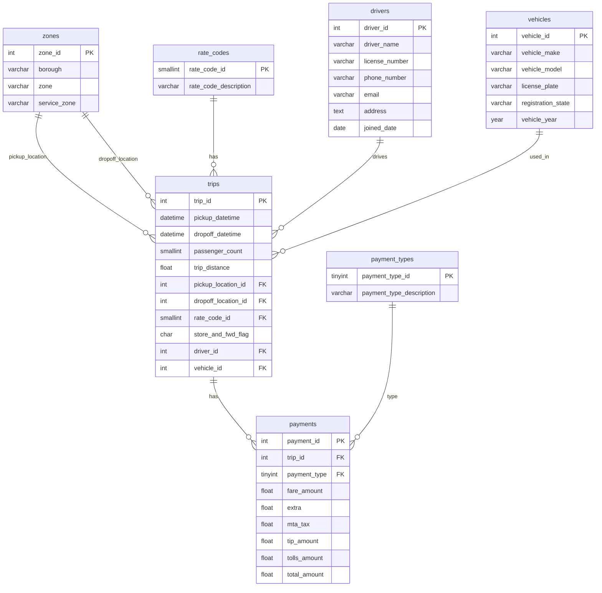

### Building our application - Working with Data

**Overview**

In this lab we are going to take a slight detour and spend some time looking at how next generation developer tools like Amazon Q Developer can help us be more effecient when working with data. We have already seen how we can use Amazon Q to help us scaffold data models, but we can do more than that. We are going to dive a little deeper into that topic before looking at how we can write queries, understand database applications written in SQL, show how Database System Administrators (DBA's) can benefit, explore the wonderful world of synthentic data generation, and more.

> **Additional Reading Materials**
>
> *Here are some additional reading materials that are useful to dive deeper into how large language models and generative AI developer tools like Amazon Q work with SQL. After you have completed this lab you might find them helpful if you want to have a deeper understanding of how they work
>
> * [Improving how Amazon Q writes SQL by using context](https://community.aws/content/2oft0CjVFvJFbRoPlLdUbi7o6hM/writing-sql-with-amazon-q-developer-workspace-context)
> * [Good practices for using text to SQL] (https://community.aws/content/2oRFLQEJj1RWA8OumcGD9lNv7JY/best-practices-for-text-to-sql-use-cases-with-llms)
>

---

**Task D1**

1/ We are going to first set our codebase to the following baseline so everyone is on the same page.

```
git checkout lab-01
```

2/ Next we are going to use a VSCode plugin called [Database Client JDBC](https://marketplace.visualstudio.com/items?itemName=cweijan.dbclient-jdbc) which makes it super easy to access databases via graphical UI.

3/ Close all open files and tabs from within VSCode. From the Amazon Q Chat interface, enter the following:

> Create SQL code for a customer feedback application

Review the output. Keep the chat interface conversation open.

4/ Open up the **app.py** Python code so that it is displayed within the VSCode editor, and then repeat the prompt:

> Create SQL code for a customer feedback application

Review: How does the chat interface language change? What does the SQL look like? This is an example of how Amazon Q uses the file you have open to provide more context. This is very important as you use these tools to understand how to influence the output.

5/ Close the app.py so that you have no open files. Close the chat tab to close the conversation, and then open up a new chat interface tab. Type in the following prompt:

> Create a data model for a customer survey application in Python

Review the output. This time open the **customer-feedback.sql** in the data folder so that it is the only file open in VSCode. Enter the prompt again:

> Create a data model for a customer survey application in Python

Review: How does the output differ? Again, you can see how having a specific file open can help you get better output.


**Task D2**

In this task we are going to see how we can generate diagrams from our SQL, as well as generate SQL from our diagrams. We will need to install a VSCode plugin if you do not already have this installed. From the VSCode marketplace, find the following plugin


You can use [this link](https://marketplace.visualstudio.com/items?itemName=shd101wyy.markdown-preview-enhanced)

This will provde you with a new option when you right click on any markdown document, as follows:


1/ Open up the **customer-feedbck.sql** file and from a new chat interface, add the following prompt:

> create a mermaid diagram of this sql code that I can display in a markdown doc

Review the output. In the same directory (data) create a new file called **"customer-feedback.md"** and add then copy the contents into the file. If you try and display this as it is, it will not work ( try it ). We need to add the markdown tag so that it knows to use the Mermaid diagram extension. If you are new to this, we can easily do this with the help of Amazon Q.

2/ Select all the code in the newly create file, and then use the Amazozn Q menu integration (right click, Amazon Q > Send to Prompt). From the prompt, enter the following:

> Add the markdown to display this

After a while you should see some updated code. Overwrite the contents with the output from the chat inteface (after reviewing), and then try again with the enhanced Markdown preview. You should get something like this.


Close all the tabs in VScode.

3/ We can also generate SQL from existing mermaid diagrams we might have. This can be useful if you have some applications documented but you do not have the SQL code to recreate it. We are going to try this using a mermaid diagram that is not related to this application we are building. The New York Taxi data set is a very well known data set used when demoing data and analytics solutions. We have a mermaid diagram that explains the schema for this data.




Create a new folder called "lab-data" and then within this folder create a new file called "ny-taxi.md" and copy the contents of this file into file. Once saved, you can explore using the enhanced Markdown preview.

4. We will now generate SQL code from this by using the following prompt:

> generate SQL code from this mermaid diagram

Review the output. Does it look ok to you?

Before we proceed, close all open tabs in VSCode.


**Task D3**

We can use Amazon Q Developer to help us translate SQL from one dialect to another. Developers may occasionally need to work between different SQL dialects (for example, SQL Server and PostgreSQL) and so having a tool that can automte this tedious task is going to be really helpful. 


**Task D4**

If you spend a lot of time working with data, then it might be a good idea to create a personalisation document that will help tailor the output of Amazon Q to your needs. We have already seen this during the setting up parts of this workshop, but lets explore what a database personalised document might look like.

1/ Within the .qdeveloper folder create a new file called DBA.md

2/ Add the following text within this new file

```
```

3/ Save the file, and then run the following prompt to see if it has worked

>


**Task D5**

Understanding SQL code that you have been provided (perhaps you are fixing a bug of an application, or been given an application to review) can be a hard job depending on how well that application has been documented. We can use Amazon Q Developer to help us understand a given code base.


-Explaining and understanding SQL code


**Task D6**

You can simplify how you create your SQL code by scaffolding your design using YAML. In this task, we are going to take a sample application schema which we have documented using a YAML format, and then get Amazon Q Developer to help us create the corresponding SQL. Lets take a quick look at this.

1/ Here is a sample YAML that might describe a table in our application. In the lab-data folder, create a new file called **"customer-feedback.yaml"** and copy this into that file and save it.

```
---
name: customer_feedback
description: Customer feedback and comments
columns:
  - name: customer_id
    type: VARCHAR(3)
    description: The unique identifier associated with each customer
  - name: comment
    type: VARCHAR(50)
    description: Free text input
  - name: created_at
    type: TIMESTAMP WITH TIME ZONE
    description: The timestamp noting when the customer create feedback entry
```

2/ Make sure all open files are closed, and open just this new file you have created. It should be the only open tab in your IDE

3/ Try the following prompt:

> generate SQL from the yaml

Review the output. Does it look ok?

4/ Close the file in VSCode and this time open up the **"customer-feedback.sql"** in the data folder. We will now generate YAML from this by using the following prompt:

> describe this SQL as YAML

Review the output. Does it look ok?


---

**Task D7**

Writing Queries
-human/text to SQL
-improve on existing SQL and make suggestions

---

**Task D8**

DBA functions

-export/import data and tools
-troubleshoot issues and errors

---

**Task D9**

Generating test data

-create an app to generate sample data for our application
-ask it to look at the app and build a data generator that will create surveys, with three options with randomised results
-run it to create 10000 records
-export it to generate csv file
-update to create parquet and avro files

---

**Task D10**


Creating DAGs

create a simple dag to process the csv file produced from the survey app
add new tasks to copy to an S3 bucket
ask chat on how you can test this

Data warehouse
add data into warehouse - https://clickhouse.com/docs/en/getting-started/quick-start


---

**Task Dxx**

We have now completed this data focused lab. We can proceed with building our application, but before we do that we need to clean up our working environment. Follow these instructions.

```
delete the working files
git stash
```
and now we can reset the repo as follows

```
git checkout lab-01
```

**Complete:** Now that you have had a chance to experience how Amazon Q can help you with data, you can proceed to the next lab, [Part Two](building-our-app-part-2.md)


